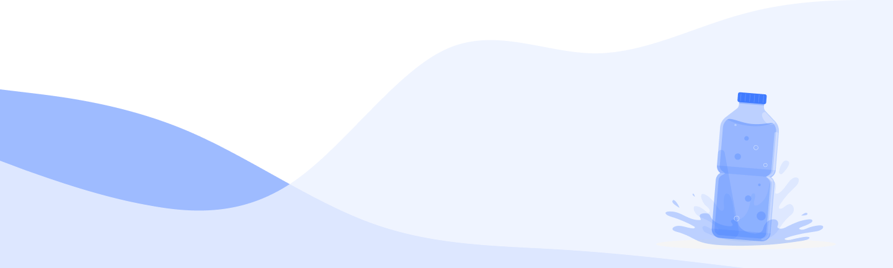

## About:

Water tracker is a project that was developed by the CodeWave team. This can
help people calculate their water intake and track its amount over time.

## Technologies:

`HTML` `CSS` `JavaScript` `React` `React hooks` `React Router` `Redux`
`Redux-toolkit` `Axios`

## Team:

1. **[Viktoriia Otsabryk](https://github.com/Viktoriia3192)** Team lead;
   Calendar
2. **[Denys](https://github.com/DenysTkachov)** Scrum Master; Welcome page
3. **[Serhii Kravchenko](https://github.com/Serhii1727)** Swagger; Endpoints:
   water, today, month; Back-end
4. **[Yevhen Bilous](https://github.com/EvgenBilous)** Sign In; Sign Up;
   Back-End
5. **[Denys Hryhorenko](https://github.com/kladmone)** Header
6. **[Dmytro Shulzhenko](https://github.com/summermoved0n)** MongoDB server;
   endpoint users; cloudinary; SettingModal
7. **[Andrii Horb](https://github.com/jn3107)** DailyNormaModal
8. **[Mark](https://github.com/Gentleman-88)** Modal; EditWater modal; Loader
9. **[Khrystyna Prokopechko](https://github.com/prokopechkok)** redux; App;
   TodayWaterList; WaterRatioPanel; RestrictedRoute; PrivateRoute; DailyNorma

## **[Back-End](https://github.com/EvgenBilous/Project01_water_backend)**
